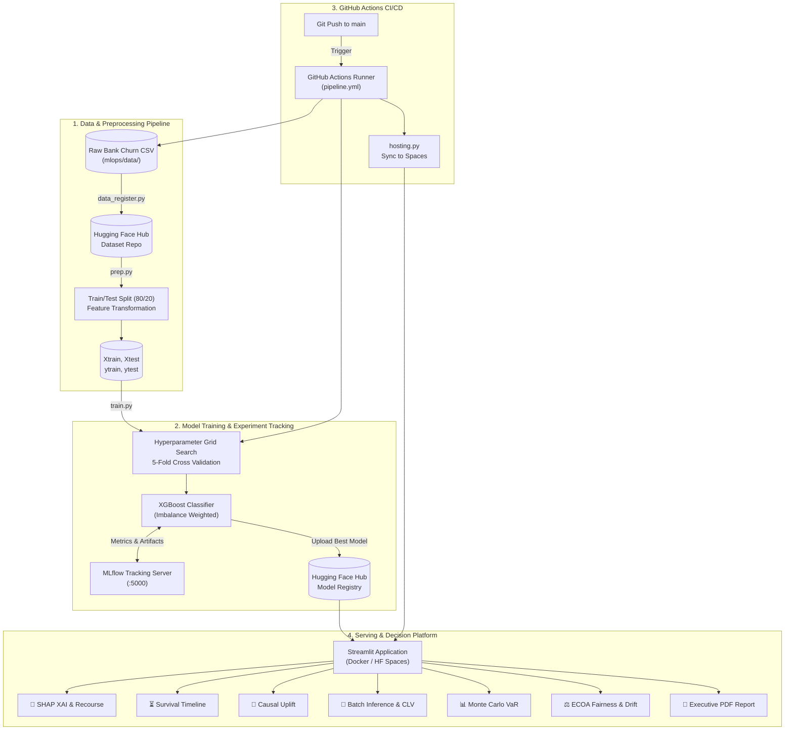
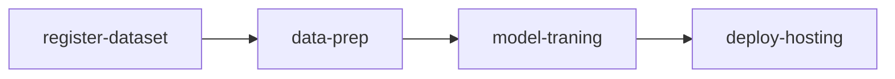

# 🏦 Bank Customer Churn Intelligence & MLOps Platform

[](https://www.python.org/)
[](https://xgboost.readthedocs.io/)
[](https://mlflow.org/)
[](https://huggingface.co/)
[](https://github.com/features/actions)
[](https://www.docker.com/)
[](https://streamlit.io/)

An enterprise-grade **End-to-End MLOps & Decision Intelligence Platform** for bank customer churn prediction, risk attribution, proactive retention strategy, and regulatory compliance.

---

## 📌 Table of Contents

- [Overview](#-overview)
- [System Architecture](#-system-architecture)
- [Key Features](#-key-features)
- [Repository Structure](#-repository-structure)
- [MLOps Pipeline & CI/CD](#-mlops-pipeline--cicd)
- [Decision Intelligence Modules](#-decision-intelligence-modules)
- [Getting Started](#-getting-started)
  - [Prerequisites](#prerequisites)
  - [Environment Configuration](#environment-configuration)
  - [Installation](#installation)
  - [Running the Streamlit Web Application](#running-the-streamlit-web-application)
  - [Running with Docker](#running-with-docker)
- [Experiment Tracking with MLflow](#-experiment-tracking-with-mlflow)
- [License](#-license)

---

## 🚀 Overview

Customer churn poses a significant threat to retail banking profitability. This project implements a production-ready Machine Learning system that moves beyond basic binary classification to deliver **actionable business intelligence**:

1. **Automated CI/CD MLOps Pipeline**: Orchestrates dataset registration, automated preprocessing, hyperparameter optimization with MLflow tracking, and zero-downtime deployment to Hugging Face Spaces.
2. **Explainable AI (XAI)**: Quantifies exact churn risk drivers for individual customer profiles using SHAP local attribution.
3. **Actionable Recourse**: Generates counterfactual "what-if" guidance to lower churn risk into safe territory.
4. **Time-to-Churn Survival Modeling**: Estimates 24-month retention trajectories and hazard timelines.
5. **Causal Uplift Matrix**: Segments customers into *Persuadables*, *Sure Things*, *Lost Causes*, and *Sleeping Dogs* to maximize retention budget ROI.
6. **Financial Risk & Regulatory Compliance**: Computes 95% Value-at-Risk (VaR) deposit loss via Monte Carlo simulations and audits fairness under the ECOA 4/5th Disparate Impact rule.

---

## 🏗️ System Architecture



---

## 🌟 Key Features

| Feature | Description | Module / Tab |
| :--- | :--- | :--- |
| **Individual Risk & SHAP XAI** | Real-time churn probability gauge with directional SHAP risk force indicators. | Tab 1 (`shap_explainer.py`) |
| **Counterfactual Recourse** | Prescribes specific actionable adjustments (e.g., product bundling, active banking enrollment) to convert high-risk clients. | Tab 1 (`counterfactual.py`) |
| **LLM Retention Outreach** | Automatically drafts tailored email and SMS communication copy targeted to customer characteristics. | Tab 1 (`llm_outreach.py`) |
| **Survival Timeline Modeling** | 24-month retention probability curve and estimated lifespan modeling. | Tab 2 (`survival_analysis.py`) |
| **Causal Uplift Matrix** | Isolates *Persuadables* so retention budgets are allocated only where marketing intervention works. | Tab 3 (`uplift_modeling.py`) |
| **Batch CSV Processor** | Batch scoring with automatic column header fuzzy matching, Customer Lifetime Value (CLV) computation, and optimal threshold selection. | Tab 4 (`roi_calculator.py`) |
| **Monte Carlo Portfolio VaR** | 1,000-iteration stochastic simulation calculating the 95% Value-at-Risk (VaR) in deposit outflows. | Tab 5 (`monte_carlo_sim.py`) |
| **ECOA Fair Lending Audit** | Audits age demographic groups against the regulatory 4/5th (80%) Disparate Impact ratio. | Tab 6 (`fairness_audit.py`) |
| **Evidently Data Drift** | KS-test based feature distribution shift monitoring on production batches. | Tab 6 (`drift_monitor.py`) |
| **Executive PDF Export** | Generates publication-ready PDF briefings using ReportLab for C-level leadership. | Tab 7 (`pdf_generator.py`) |

---

## 📂 Repository Structure

```text
Project-4/
├── .github/
│   └── workflows/
│       └── pipeline.yml          # GitHub Actions 4-stage CI/CD pipeline definition
├── mlops/
│   ├── analytics/                # Advanced Decision Intelligence modules
│   │   ├── counterfactual.py     # DiCE-style what-if actionable recourse generator
│   │   ├── fairness_audit.py     # ECOA 4/5th rule disparate impact fairness auditor
│   │   ├── llm_outreach.py       # Personalized retention email & SMS copy generator
│   │   ├── monte_carlo_sim.py    # 1,000-trial Monte Carlo VaR portfolio deposit loss
│   │   ├── roi_calculator.py     # CLV estimation and optimal threshold profit curve
│   │   ├── shap_explainer.py     # SHAP local feature importance attribution
│   │   ├── survival_analysis.py  # 24-month retention curve and survival estimator
│   │   └── uplift_modeling.py    # Causal uplift marketing segmentation
│   ├── data/
│   │   └── bank_customer_churn.csv # Raw customer banking churn dataset
│   ├── deployment/               # Deployment artifacts for Streamlit UI
│   │   ├── Dockerfile            # Container definition for Hugging Face Spaces / cloud
│   │   ├── app.py                # 7-tab Streamlit Enterprise Platform
│   │   └── requirements.txt      # Deployment runtime dependencies
│   ├── hosting/
│   │   └── hosting.py            # Script to push deployment package to HF Spaces
│   ├── model_building/           # Model training & data processing pipeline
│   │   ├── data_register.py      # Dataset upload & versioning to Hugging Face Hub
│   │   ├── prep.py               # Preprocessing, train-test splitting, and hub upload
│   │   └── train.py              # XGBoost training, GridSearchCV, & MLflow logging
│   ├── monitoring/
│   │   └── drift_monitor.py      # Production data drift detection module
│   ├── reports/
│   │   └── pdf_generator.py      # C-Suite Executive PDF report compiler (ReportLab)
│   └── requirements.txt          # Training and pipeline dependencies
├── MLOps_ _CICD_ _Experimentation_w_Github_Actions.ipynb # Interactive prototyping notebook
├── pipeline.yml                  # Root CI/CD workflow specification
└── README.md                     # Project documentation
```

---

## 🔄 MLOps Pipeline & CI/CD

The automated CI/CD pipeline runs on **GitHub Actions** (`pipeline.yml`) on every push to the `main` branch:



1. **`register-dataset`**: Authenticates with Hugging Face Hub using secret token (`HF_TOKEN`) and syncs the raw data to `weiqi001/bank-customer-churn-4`.
2. **`data-prep`**: Downloads raw data from Hugging Face, performs feature engineering, executes stratified 80/20 train/test split, and publishes split datasets (`Xtrain.csv`, `Xtest.csv`, `ytrain.csv`, `ytest.csv`).
3. **`model-traning`**:
   - Launches a local background MLflow tracking server.
   - Computes positive class imbalance weights: `scale_pos_weight = N_neg / N_pos`.
   - Runs `GridSearchCV` over 5-fold cross validation exploring hyperparameter combinations (tree depth, learning rate, subsampling, regularization).
   - Logs metrics (accuracy, precision, recall, F1-score) and serializes the best estimator (`best_churn_model_v1.joblib`).
   - Uploads model artifact to the Hugging Face Model Hub (`weiqi001/churn-model`).
4. **`deploy-hosting`**: Bundles the `mlops/deployment/` assets and synchronizes the frontend to Hugging Face Spaces.

---

## 🧠 Decision Intelligence Modules

### 1. SHAP Explainability & Recourse
- Explains model predictions by calculating local SHAP values for demographic and financial inputs.
- Identifies critical thresholds (e.g., `Age > 40`, `NumOfProducts != 2`, inactive member status) and suggests actionable changes that flip the prediction from churn to retain.

### 2. Survival Analysis
- Computes hazard rates and generates 24-month retention survival curves:
  $$\text{Survival}(t) = \exp(-\lambda \cdot t) \times 100$$
- Estimates median customer lifetime in months and assigns hazard risk classifications.

### 3. Causal Uplift Segmentation
- Classifies customer accounts into 4 core quadrant profiles:
  - **🎯 Persuadables**: High churn risk, inactive — prime target for retention discounts.
  - **🔒 Sure Things**: Low churn risk — no incentives needed.
  - **❌ Lost Causes**: Extreme churn probability — low intervention ROI.
  - **⚠️ Sleeping Dogs**: Unlikely to churn — should not be spammed with promotional alerts.

### 4. Monte Carlo Risk & VaR Simulation
- Conducts 1,000 randomized Bernoulli trials across customer balances to determine the **95% Value-at-Risk (VaR)** in potential deposit loss.

### 5. Fair Lending Compliance
- Calculates the Disparate Impact Ratio across protected age classes:
  $$\text{Disparate Impact Ratio} = \frac{\text{Selection Rate}_{\text{protected}}}{\text{Selection Rate}_{\text{reference}}}$$
- Validates compliance against the US Equal Credit Opportunity Act (ECOA) 4/5th (80%) benchmark.

---

## 💻 Getting Started

### Prerequisites

- Python 3.9 or 3.10
- Git
- Hugging Face account and User Access Token (`HF_TOKEN`)
- Docker (optional, for containerized execution)

### Environment Configuration

Create a `.env` file or export your Hugging Face token:

```bash
export HF_TOKEN="your_huggingface_write_token_here"
```

On Windows PowerShell:
```powershell
$env:HF_TOKEN="your_huggingface_write_token_here"
```

### Installation

1. **Clone the repository:**
   ```bash
   git clone https://github.com/weiqi001/Project-4.git
   cd Project-4
   ```

2. **Create and activate a virtual environment:**
   ```bash
   python -m venv .venv
   
   # Linux/macOS:
   source .venv/bin/activate
   
   # Windows:
   .venv\Scripts\activate
   ```

3. **Install dependencies:**
   ```bash
   pip install -r mlops/requirements.txt
   pip install -r mlops/deployment/requirements.txt
   ```

---

### Running the Streamlit Web Application

To run the full multi-tab decision intelligence dashboard locally:

```bash
streamlit run mlops/deployment/app.py
```

The application will be accessible at `http://localhost:8501`.

---

### Running with Docker

Build and run the container locally:

```bash
# Navigate to deployment folder
cd mlops/deployment

# Build Docker image
docker build -t bank-churn-platform .

# Run Docker container
docker run -p 8501:8501 -e HF_TOKEN="your_token" bank-churn-platform
```

Access the dashboard at `http://localhost:8501`.

---

## 📊 Experiment Tracking with MLflow

To launch the MLflow UI and inspect hyperparameter runs, loss curves, and artifact logs:

```bash
# Start MLflow UI server
mlflow ui --host 0.0.0.0 --port 5000
```

Open `http://localhost:5000` in your browser to explore:
- Cross-validation results across parameter grids.
- Precision-Recall and ROC performance comparisons.
- Versioned model artifacts.

---

## 👥 Authors & Acknowledgments

- **Developer / Maintainer**: [weiqi001](https://huggingface.co/weiqi001)
- Built with **Streamlit**, **Scikit-Learn**, **XGBoost**, **MLflow**, and **Hugging Face Hub**.

---

## 📄 License

This project is licensed under the [MIT License](LICENSE).
